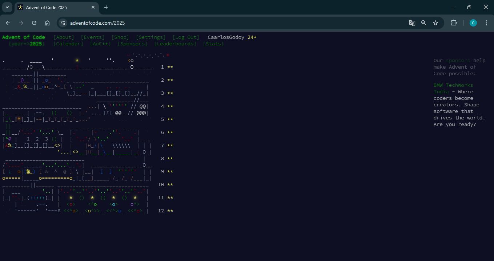
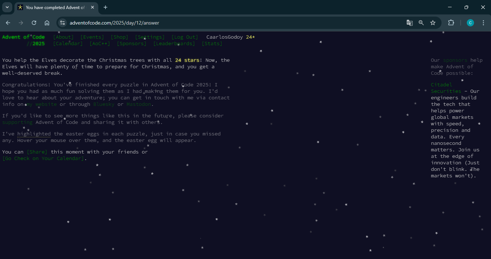

# ADVENT OF CODE 2025
## CARLOS GODOY DE LEÓN
### AoC Terminado

Este repositorio contiene mis soluciones para el Advent of Code de 2025, usando como lenguaje de programación Java y utilizando como metodología de diseño TDD (Test-Driven Development).

Por ello, para cada uno de los 12 días tenemos la solución para ambas partes, algunas implementaciones están separadas y otras dentro de la misma clase, según la diferencia entre ambas partes, y una serie de tests para todos los problemas, incluyendo siempre la solución del input que nos proponía el AoC. Además, cada uno de los 12 días incluye un README en el directorio doc, donde se explica el problema, cómo lo he resuelto, qué dificultades he encontrado y qué conceptos de Ingeniería del Software he aplicado.

En cuanto a esto último, los conceptos aplicados, en cada README he explicado algunos de ellos, intentando en su conjunto mencionar el máximo posible, pero realmente en todos los problemas he tratado de respetarlos y aplicarlos todos. Por desgracia, hay varios que no he podido implementar, como pueden ser la mayoría de patrones, ya que no he encontrado dónde meterlos sin que fuese muy forzado, a excepción de Factory Method y el patrón de comportamiento Command. Me gustaría centrarme en los siguientes conceptos, que son los que he aplicado a lo largo de todas las implementaciones:

#### TÉCNICAS
* Good Naming: Intentamos darle a cada método el nombre que más se ajuste a su función, buscando la mayor legibilidad posible.
* Programación Estructurada: Al igual que el anterior, buscamos potenciar la legibilidad, de manera que utilizaremos métodos pequeños, quedando muy claro cuál es su objetivo. Además, fomentamos el uso de streams sobre bucles y minimizamos el número de variables. He intentado hacerlo lo mejor posible en este aspecto, pero hay ciertos casos donde no ha sido del todo posible, sobre todo respecto al número de variables que recibía cada método.

#### FUNDAMENTOS
* Abstracción: Consiste en ocultar los detalles complejos detrás de una interfaz simple. Por ejemplo, en días donde existen cálculos complejos, ocultamos esta lógica en uno o dos métodos, y el resto del código no sabe cómo se obtienen esos resultados. 
* Modularidad: Dividimos nuestro código en varias clases o interfaces, buscando que cada una tenga su función propia. 
* Acoplamiento: Buscamos que estos módulos tengan bajo acoplamiento entre sí, es decir, que dependan lo menos posible unos de los otros. 
* Cohesión: Las partes de un módulo deben estar muy relacionadas y enfocadas en una única tarea. 
* Polimorfismo: Lo aprovechamos, por ejemplo, mediante la sobrecarga, cuando creamos dentro de la misma clase dos métodos con el mismo nombre, ya que Java los trata como diferentes gracias a sus parámetros.
* Inmutabilidad: Utilizamos objetos y estructuras de datos que no puedan ser modificados una vez creados. 

#### PRINCIPIOS
* DRY (Don't Repeat Yourself): Evitamos repetir código. 
* KISS (Keep It Simple, Stupid): No forzamos implementaciones complejas, si se puede hacer con menos no tiene sentido complicarse. 
* YAGNI (You Ain't Gonna Need It): No programamos más de lo necesario, únicamente lo indispensable para resolver el problema. 
* SOLID 
  * SRP (Single Responsibility): Cada clase tiene una única función, al igual que sus métodos. 
  * OCP (Open/Closed): Nuestro código está abierto a ser ampliado, sin necesidad de modificar en exceso lo que ya tenemos. Esto se ve muy claro en los problemas donde implementamos interfaces. 
  * Liskov: Este principio establece que las clases hijas deben poder sustituir a sus clases padre sin alterar el funcionamiento del programa. Para este en concreto no he encontrado ningún caso donde aplicarlo. 
  * Interface SP (Interface Segregation): Ninguna clase debería ser forzada a depender de métodos que no utiliza, es decir, que nos conviene más crear varias interfaces diferentes, que tener una sola pero que luego sus implementaciones realmente no necesiten ni la mitad de los métodos. 
  * DIP (Dependency Inversion): Se ve muy claro en el día 2, nuestra clase principal no depende de cómo son por dentro nuestras implementaciones de las interfaces.